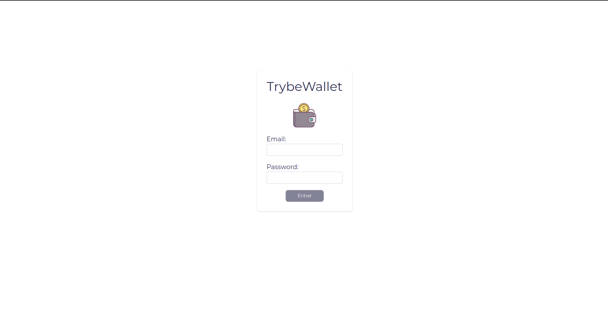
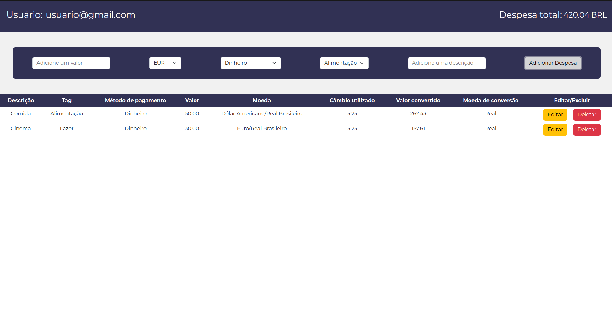

# Boas-vindas ao repositório do projeto TrybeWallet!

> Este projeto foi desenvolvido durante o curso de Desenvolvimento de Software da Trybe. O TrybeWallet é uma carteira de controle de gastos, onde é possível adicionar, editar e remover uma despesa, além de visualizar uma tabela com as despesas cadastradas.

---

- Desenvolvido por: [Júnior Carvalho](https://www.linkedin.com/in/juniorcarvalh0)
- Demostração: [TrybeWallet](https://jun1orcarvalh0.github.io/trybe-wallet/#/)

---
